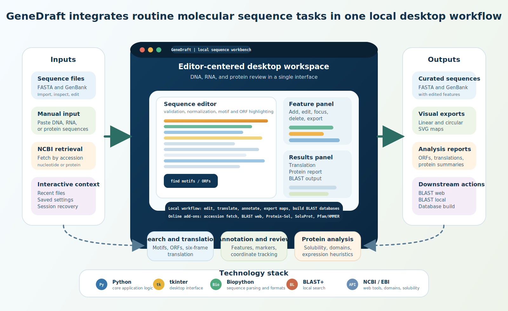
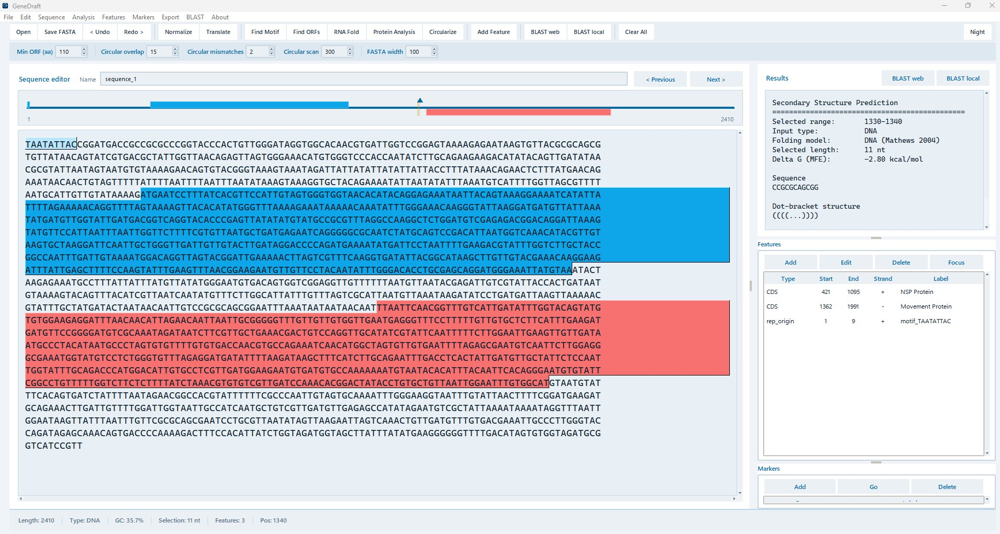
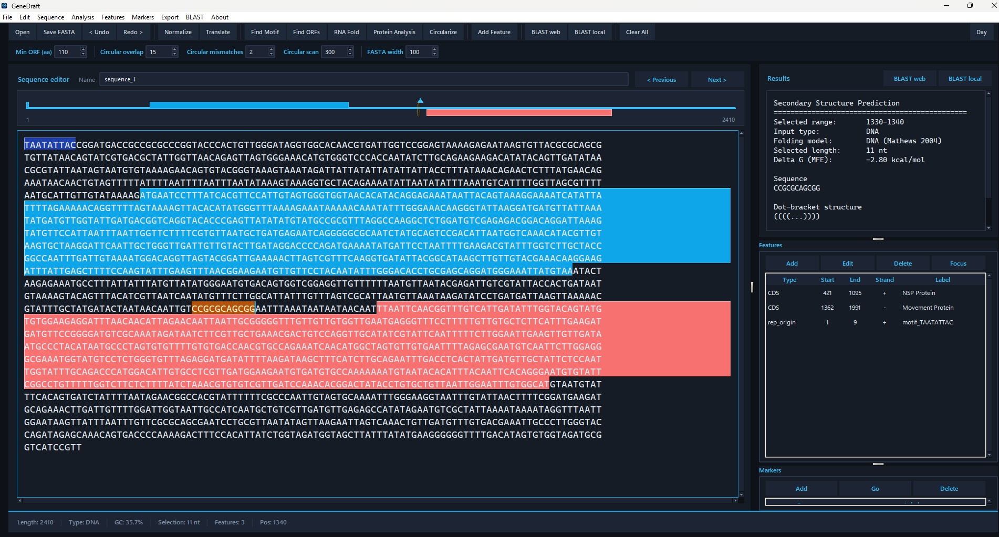

# GeneDraft

GeneDraft is a local desktop workbench for DNA, RNA, and protein sequence editing and exploratory analysis.

It is designed for small-to-medium sequence tasks that are often spread across separate editors, web services, and ad hoc scripts. GeneDraft does not try to replace specialized high-throughput or genome-scale tools; its value is a local-first, editor-centered workflow for routine sequence work.



## Author

Yair Cárdenas-Conejo*1,2

1. Secretaría de Ciencia, Humanidades, Tecnología e Innovación, Gobierno de México, Ciudad de México, México
2. Centro Universitario de Investigaciones Biomédicas, Universidad de Colima, Colima, Colima, México

Corresponding author: Yair Cárdenas-Conejo*

ORCID: `0000-0002-0190-244X`

## Interface Preview

### Light theme



### Dark theme



## What GeneDraft is for

- quick inspection of DNA, RNA, or protein sequences in one window
- construct review and lightweight annotation cleanup
- selection-based translation and secondary-structure inspection
- bench-adjacent sequence checking before moving to heavier tools
- teaching and demonstration of common sequence operations

## Important Windows note

For `BLAST local` and `makeblastdb` on Windows, keep the project in a folder path with **no spaces**.

Recommended:

- `C:\Users\yairc\Desktop\GeneDraft`

Avoid:

- `C:\Users\yairc\Desktop\Editseq - copia`

The same rule applies to FASTA files and BLAST database paths used by the app.

## Current capabilities

- Open `FASTA` and `GenBank`
- Save to `FASTA` and `GenBank`
- Edit sequences in a single workspace
- Detect sequence type: DNA, RNA, or protein
- Show length, `%GC`, cursor position, and selection size
- Validate characters and highlight errors
- Compute and apply reverse complement
- Convert DNA to RNA
- Search motifs and highlight hits in the editor
- Search ORFs across the full sequence
- Translate the current selection
- Predict DNA/RNA secondary structure for the current selection
- Export the secondary-structure SVG on demand from the Results panel context menu
- Detect circularization candidates from terminal overlap in a selected region
- Mark or crop a circular component candidate
- Create, focus, edit, and delete `features`
- Import `features` from GenBank and export them back
- Export linear and circular `SVG` maps
- Copy the current sequence as FASTA
- Launch `BLAST web` from the current selection
- Run `BLAST local` from the current selection
- Build a local database with `makeblastdb` from FASTA

## What it is not

- not a genome browser
- not a high-throughput analysis platform
- not a substitute for formal comparative genomics pipelines
- not a full structural-biology environment
- not a validated predictor for protein expression, solubility, or structure

## Shortcuts

- `Ctrl+O`: open file
- `Ctrl+S`: save FASTA
- `Ctrl+Shift+S`: save GenBank
- `Ctrl+Shift+C`: copy FASTA
- `Ctrl+L`: normalize
- `Ctrl+Shift+L`: clear all
- `F5`: validate
- `Ctrl+R`: reverse complement
- `Ctrl+T`: translate selection
- `Ctrl+Alt+S`: predict secondary structure
- `Ctrl+F`: find motif
- `Ctrl+Shift+F`: find ORFs across the full sequence
- `Ctrl+E`: add feature
- `F6`: next result
- `Shift+F6`: previous result
- `Esc`: clear analysis highlights

## Run

```bash
python -m pip install -r requirements.txt
python GeneDraft.py
```

`Secondary structure` requires `ViennaRNA` from `requirements.txt`.

`BLAST local` requires NCBI BLAST+ executables available in `PATH`.

## Availability and citation

- Repository URL: `https://github.com/yaircardenas/GeneDraft`
- Archived release DOI: `https://doi.org/10.5281/zenodo.19445034`
- Software concept DOI: `https://doi.org/10.5281/zenodo.19445033`
- License: `MIT`
- Version described in the current draft: `1.0`

If you use GeneDraft, cite the software release and, when available, the associated preprint. Citation metadata is provided in [`CITATION.cff`](CITATION.cff).

## Next useful steps

- restriction sites
- primers
- selection-synced translation panel
- richer feature editing
- strand and qualifiers support
